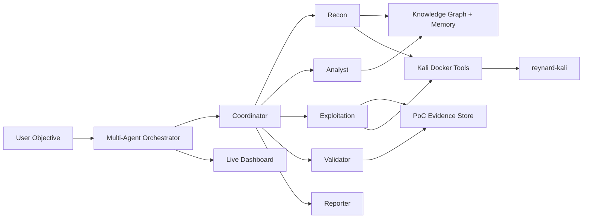

# 🦊 Reynard

<p align="center">
  <b>Autonomous AI agent for CTF labs and authorized security testing</b>
</p>

<p align="center">
  
  
  
  
  
</p>

Reynard is a structured multi-agent hacking assistant that runs against **authorized CTF, lab, and pentest targets**. It combines LLM reasoning with a Kali Docker runtime, a **real headless Chromium browser** (DOM/JS with `alert()` capture), **automatic tool selection**, **structured scanner parsing**, **local RAG over the methodology corpus**, **durable cross-run memory**, a **hypothesis-agenda orchestrator** (phase chaining, backtracking, pivot, and self-critique), **cross-domain support** (web / network / pwn / mobile / CTF), and **token/cost metering with budget caps**.

> **Use only on systems you own, intentionally vulnerable labs, CTF infrastructure, or targets where you have explicit written authorization.**

---

## ✨ Highlights

- 🧠 **Multi-agent workflow**: coordinator, bounded bootstrap subagents, recon, analyst, exploitation, validator, reporter.
- 🛠️ **Kali tool runtime**: `sqlmap`, `nmap`, `ffuf`, `nuclei`, `gobuster`, `nikto`, `john`, `hashcat`, `radare2`, `binwalk`, `frida`, `objection`, and more.
- 🧰 **Z4nzu HackingTool awareness**: `/opt/hackingtool/hackingtool.py` is available inside the container, with direct tools preferred for automation.
- 👀 **Live dashboard**: watch decisions, tool calls, findings, memory, and validation while the agent runs.
- 🔎 **Web research**: CTF writeups, public CVEs, advisories, and official docs via `web_search` / `web_fetch`.
- 🧾 **Memory and deduplication**: remembers payloads, failed attempts, facts, knowledge graph entities, and lessons.
- 🔁 **PoC validation**: validator replays successful payloads and demotes weak findings.
- 🧪 **Expert lab playbooks**: deterministic priors for PortSwigger practitioner/expert classes including JWT, request smuggling, cache poisoning, SSTI, prototype pollution, GraphQL, race conditions, and business logic labs.
- 📏 **Offline lab readiness eval**: `reynard-lab-eval` checks target parsing, profile detection, prerequisites, and evidence plan before a live run.
- 🧵 **Bounded subagents**: safe profile/readiness/analysis lanes run in parallel; exploitation remains serialized unless a race-condition playbook explicitly opts in.
- ☁️ **Caido support**: local Replay/history bridge for testing plus Cloud API for user/team/workspace/subscription/PAT operations.
- 🧩 **Burp MCP fallback**: traffic/repeater/intruder/collaborator tools when the Burp MCP extension is online.
- 🌐 **Real browser**: headless Chromium via Playwright runs inside the container for genuine DOM/JS execution and XSS `alert()` proof (`browser_navigate` / `browser_execute_js` / `browser_interact`).
- 🎯 **Automatic tool selection**: a deterministic selector recommends the best tools per vuln-class/phase/tech stack at each phase entry (`recommend_tools`).
- 🧷 **Structured scanner parsing**: `ffuf`, `sqlmap`, `nmap`, and `nuclei` output is parsed into structured signals instead of raw text.
- 📚 **RAG methodology retrieval**: the `methodologies/` corpus is chunked, embedded (sentence-transformers → Ollama → BM25 fallback), and retrieved per active hypothesis + phase.
- 🗃️ **Durable cross-run memory**: an opt-in-safe SQLite store remembers verified techniques and dead-ends per target/lab-class and rehydrates them on the next run.
- 🧭 **Hypothesis-agenda orchestration**: a first-class ranked agenda drives the 6-phase StrategyEngine with real backtracking (failed vectors are demoted), a high-reasoning `pivot` role when stuck, and one self-critique pass before ever concluding failure. Report gating blocks premature "done" while untried vectors remain.
- 🌍 **Cross-domain targets**: a category profiler routes web / network / pwn(binary) / mobile / crypto / stego / forensics / CTF-misc targets, each seeding a category-appropriate agenda (`metasploit_run`, `radare2_analyze`, `gdb_debug`, `pwn_template`, `apk_decompile`, `frida_hook`, `stego_extract`, `hash_crack`, `crypto_helper`, `forensics_triage`, `flag_hunter`, …).
- 💰 **Token/cost metering + budgets**: every LLM call is metered; `LLM_MAX_TOKENS_BUDGET` / `LLM_MAX_COST_BUDGET` force a final report when exceeded.
- 📊 **Live solve-rate eval**: `reynard-lab-eval --live` runs real end-to-end labs and emits a solved/attempted scorecard (offline mode remains a readiness check).

---

## ⚠️ Scope And Safety

Reynard is designed for:

- ✅ PortSwigger Web Security Academy labs
- ✅ Hack The Box / TryHackMe / CTF boxes you are allowed to attack
- ✅ Local vulnerable apps such as DVWA, Juice Shop, WebGoat, intentionally vulnerable Docker labs
- ✅ Authorized pentest environments with a defined scope

Do not use Reynard for:

- ❌ Targets without permission
- ❌ DDoS, phishing, RAT, credential stuffing, or social engineering outside a sanctioned lab
- ❌ Wireless deauth or disruptive testing unless explicitly in scope
- ❌ Production testing without rate limits, test windows, and written approval

---

## 🧭 Architecture



---

## 📁 Project Structure

```text
reynard/
|-- agent.py                 # Single-agent compatibility launcher
|-- orchestrator.py          # Multi-agent launcher
|-- Dockerfile               # Kali image with tools, headless Chromium (Playwright), Z4nzu HackingTool
|-- docker-compose.yml       # Starts container named reynard-kali
|-- requirements.txt         # Python dependencies
|-- pyproject.toml           # Package metadata
|-- .env.example             # Safe environment template
|-- methodologies/           # Bug-class playbooks mounted to /data/methodologies
|-- logs/                    # Run logs, ignored by git
|-- tests/                   # Tests and fixtures
`-- src/hacking_agent/
    |-- agents/              # coordinator, recon, analyst, exploitation, validator, reporter
    |-- cli/                 # CLI entry points
    |-- core/                # memory, schemas, tools, state machine, providers
    |-- integrations/        # Burp and Caido clients
    `-- ui/                  # Live dashboard
```

---

## 🚀 Quick Start On Windows PowerShell

### 1. Configure environment

```powershell
Copy-Item .env.example .env
notepad .env
```

Set at least one LLM provider key. Example for DeepSeek/OpenAI-compatible:

```env
LLM_DEFAULT_PROVIDER=openai-compatible
LLM_DEFAULT_MODEL=deepseek-v4-pro
LLM_DEFAULT_BASE_URL=https://api.deepseek.com/v1
LLM_DEFAULT_API_KEY=sk-your-key
```

### 2. Install Python dependencies

```powershell
python -m venv venv
.\venv\Scripts\Activate.ps1
pip install -r requirements.txt
```

Optional: install the local RAG vector backend (sentence-transformers) for
higher-quality methodology retrieval. Without it, retrieval falls back to
pure-Python BM25:

```powershell
pip install "reynard[rag]"
```

### 3. Build and start the Kali runtime

```powershell
docker compose build
docker compose up -d
docker ps --filter "name=reynard-kali"
```

The container is named:

```text
reynard-kali
```

The image can be large and the first build can take a long time because it installs Kali packages, Go tools, the Z4nzu HackingTool repository, headless **Chromium via Playwright** (real DOM/JS + `alert()` capture), and the cross-domain toolchain (`gdb`/`pwntools`, `radare2`, `apktool`/`jadx`/`frida`, `exiftool`, `tshark`, `steghide`, `zsteg`, `hashcat`/`john`). The build fails loudly if Playwright/Chromium or any required Go binary is missing.

### Verify the runtime (preflight)

Before a live run, validate provider config, scope, Kali tools, Chromium/Playwright, and the Caido bridge — then exit:

```powershell
python orchestrator.py --preflight "https://TARGET"
```

`--preflight` prints a readiness score (0–100) and per-tool status and exits without dispatching any specialist.

### 4. Run the multi-agent orchestrator

```powershell
python orchestrator.py --ui --no-oob --max-iterations 25 "Solve this authorized CTF/lab target: https://TARGET"
```

Bounded bootstrap subagents are enabled by default:

```powershell
python orchestrator.py --max-subagents 4 "Authorized lab: https://TARGET"
python orchestrator.py --no-subagents "Authorized lab: https://TARGET"
```

The dashboard opens at:

```text
http://127.0.0.1:8765
```

---

## 🏁 Running Against A CTF Or Lab

### PortSwigger lab example

Run a quick offline readiness check first:

```powershell
reynard-lab-eval --case "JWT authentication bypass lab. Target: https://YOUR-LAB.web-security-academy.net/" --pretty
reynard-lab-eval --pretty
```

The default evaluator suite covers every PortSwigger topic mapped in
`docs/portswigger-coverage-matrix.md`.

#### Live solve-rate scorecard (`--live`)

The offline check validates readiness; `--live` runs the **real** multi-agent
orchestrator against a config-listed set of labs and writes a solved/attempted
scorecard (JSON + markdown) under `logs/`:

```powershell
reynard-lab-eval --live --config .\eval\labs.sample.yaml --per-lab-timeout 900 --max-total-seconds 0 --max-iterations 30
```

- `--config` — JSON/YAML list of labs (see `eval/labs.sample.yaml`; credentials come from env, never hardcoded).
- `--per-lab-timeout` — per-lab wall-clock cap (env `EVAL_PER_LAB_TIMEOUT`, default 900s, 0 = none).
- `--max-total-seconds` — stop launching new labs after this budget (env `EVAL_MAX_TOTAL_SECONDS`, 0 = unlimited).
- `--max-iterations` — default per-lab dispatch budget (labs may override).

```powershell
python orchestrator.py --ui --no-oob --max-iterations 25 "Solve this authorized PortSwigger Web Security Academy lab: SQL injection vulnerability in WHERE clause allowing retrieval of hidden data. Target: https://YOUR-LAB.web-security-academy.net/"
```

### CTF web challenge example

```powershell
python orchestrator.py --ui --max-iterations 40 "Authorized CTF target: http://10.10.10.10/. Scope: this single host only. Goal: enumerate the web app, identify the intended vulnerability, and capture the flag."
```

### CTF box with multiple services

```powershell
python orchestrator.py --ui --max-iterations 60 "Authorized CTF box: 10.10.10.10. Scope: single host only. Perform service recon, web enumeration, vulnerability analysis, exploitation proof, and report the flag path."
```

Recommended CTF flags:

- Use `--ui` so you can watch reasoning and tool calls.
- Use `--no-oob` for simple labs where blind callbacks are not needed.
- Set a clear scope in the prompt: host, domain, lab URL, allowed ports, and goal.
- Keep `--max-iterations` lower for simple web labs and higher for full boxes.

---

## 🛡️ Running In An Authorized Pentest Environment

Use a clear scope and rules of engagement in the prompt:

```powershell
python orchestrator.py --ui --max-iterations 60 "Authorized pentest assessment for https://app.example.com. Scope: app.example.com only. Test OWASP Top 10 classes. Avoid destructive actions, brute force, phishing, DDoS, persistence, and data modification. Produce reproducible PoCs and a final report."
```

With authenticated sessions:

```powershell
python orchestrator.py --ui --auth-file .\auth-sessions.json --max-iterations 60 "Authorized pentest assessment for https://app.example.com. Scope: app.example.com only. Test access control using the configured user sessions."
```

Example `auth-sessions.json`:

```json
{
  "sessions": {
    "user1": {
      "headers": {
        "Cookie": "session=USER1_COOKIE"
      }
    },
    "user2": {
      "headers": {
        "Cookie": "session=USER2_COOKIE"
      }
    }
  }
}
```

Pentest guidance:

- Define scope explicitly: domains, IPs, roles, test accounts, time window.
- State what is forbidden: brute force, destructive payloads, persistence, phishing, DDoS.
- Use `--auth-file` for IDOR and authorization testing.
- Keep the dashboard open and stop the run if it drifts outside scope.

---

## 👀 Live Dashboard

Start with `--ui`:

```powershell
python orchestrator.py --ui "Authorized lab: https://TARGET"
```

The dashboard shows:

- live model plan/decision trace
- coordinator routing
- specialist dispatches
- tool calls and blocked duplicate payloads
- web research events
- memory facts and knowledge graph updates
- PoC evidence and validation results
- provider and schema errors

Provider-hidden reasoning is not exposed unless the model provider explicitly returns a reasoning stream. The UI shows the agent's visible reasoning, decisions, and tool activity.

---

## 🧰 Tool Runtime

Reynard uses a Docker container named `reynard-kali`. Tools are executed through `run_shell`, and the agent can call `tool_inventory` to decide what to use.

Check inventory manually:

```powershell
$env:PYTHONPATH="src"
python -c "from hacking_agent.core.tools import execute_tool; print(execute_tool('tool_inventory', {'role':'general','check_container':True}))"
```

### Preferred direct tools

| Goal | Preferred tools |
|---|---|
| HTTP proof payloads | `http_request`, `curl` |
| SQL injection | `curl` for simple proof, `sqlmap` for blind/complex extraction |
| Web content discovery | `ffuf`, `gobuster`, `dirb`, `wfuzz` |
| Known CVEs and misconfig | `nuclei`, `nikto`, `whatweb` |
| Port/service recon | `nmap`, `masscan` or `rustscan` if available |
| JS/API endpoint discovery | `extract_js_endpoints`, `katana`, `gospider`, `SecretFinder` if available |
| XSS testing | `browser_execute_js`, `dalfox`, `XSStrike` if available |
| Secrets in repos/files | `trufflehog`, `gitleaks`, `SecretFinder` if available |
| Password/hash work | `john`, `hashcat`, `haiti` if available |
| AD labs | `impacket`, `nxc`, `BloodHound`, `Certipy`, `Kerbrute` if available |
| Cloud/container labs | `prowler`, `pacu`, `ScoutSuite`, `trivy` if available |
| Reversing/mobile | `radare2`, `ghidra`, `jadx`, `apktool`, `frida`, `objection` |
| Forensics/stego | `binwalk`, `foremost`, `steghide`, `volatility3` if available |

---

## 🧰 Z4nzu HackingTool

The Dockerfile clones:

```text
https://github.com/Z4nzu/hackingtool.git
```

Inside the container:

```text
/opt/hackingtool/hackingtool.py
```

Run manually:

```powershell
docker exec -it reynard-kali bash
python3 /opt/hackingtool/hackingtool.py
```

Reynard is aware of this wrapper and its major categories:

- 🛡️ anonymity / proxying helpers
- 🔍 information gathering
- 📚 wordlist and hash tools
- 🌐 web attack tools
- 🧩 SQL injection tools
- 💥 XSS tools
- 🕵️ forensics and stego tools
- 🔁 reverse engineering tools
- 📱 mobile security tools
- 🏢 Active Directory tools
- ☁️ cloud security tools
- 🔧 post-exploitation tooling for authorized labs

Important automation rule:

> The agent should prefer direct non-interactive commands such as `sqlmap`, `ffuf`, `nuclei`, `nmap`, `dalfox`, `trufflehog`, `john`, or `hashcat` when available. The Z4nzu menu is useful as a wrapper/reference, but interactive menus are less reliable for autonomous runs.

Risk-controlled categories such as phishing, DDoS, RATs, social brute force, and wireless deauth are not appropriate for normal autonomous runs unless the lab explicitly authorizes that exact behavior.

---

## ☁️ Caido

Reynard separates **Caido Cloud** from **Caido Local Bridge**:

- `caido_local_api` is the preferred path for API testing, Replay, HTTP
  history, request collections, and manual-review artifacts when the local
  bridge plugin is running.
- `caido_cloud_api` is only for Caido account/team/workspace/PAT operations.

Configure Cloud API:

```env
CAIDO_PAT=caido_YOUR_PERSONAL_ACCESS_TOKEN
CAIDO_API_BASE_URL=https://api.caido.io
```

Configure the local bridge:

```env
CAIDO_LOCAL_BRIDGE_URL=http://127.0.0.1:17650
CAIDO_LOCAL_BRIDGE_TOKEN=optional-shared-secret
```

Cloud API support:

- Caido Cloud status
- user/team information
- invitations
- workspaces
- subscriptions
- vouchers
- PAT lifecycle helpers
- raw Cloud API fallback paths

Local bridge support:

- bridge status
- send raw requests through Caido Replay
- create/send Replay sessions
- search HTTP history
- fetch history items
- create Caido findings from agent evidence

See `docs/caido-local-bridge.md` for the expected bridge contract.

---

## 🧩 Burp MCP

Burp MCP is now a fallback for Burp-specific workflows. If your Burp MCP
extension is running, Reynard can use:

- send raw HTTP/1.1 requests
- read scanner issues
- generate Collaborator payloads
- poll Collaborator interactions
- create Repeater tabs
- send requests to Intruder

If Burp MCP is offline, the agent falls back to Caido Local Bridge,
`http_request`, `curl`, OOB callbacks, and differential analysis.

---

## 🔎 Web Research

Optional search providers:

```env
BRAVE_SEARCH_API_KEY=YOUR_BRAVE_KEY
SERPAPI_API_KEY=YOUR_SERPAPI_KEY
```

The agent uses `web_search` and `web_fetch` when:

- a challenge/box name is known
- a service/version banner is discovered
- a CVE or public exploit may apply
- a command is missing or install syntax is unclear
- a tool returns an unknown flag/usage error
- it gets stuck after targeted attempts
- official docs or writeups can reduce guessing

For best search quality, configure Brave or SerpAPI. If neither key is set,
Reynard falls back to DuckDuckGo HTML search.

For blind XXE/SSRF/CMDi labs, do **not** use `--no-oob`; the agent needs OOB
callbacks through `interactsh-client`, Burp Collaborator, or another approved
callback service.

---

## ⚙️ Environment Variables

All of these are optional and have safe defaults — see `.env.example` for the
authoritative, commented list. Grouped by subsystem:

### Sampling / reasoning

```env
LLM_DEFAULT_TEMPERATURE=0.0          # preserved default 0.0
LLM_DEFAULT_MAX_TOKENS=4096          # preserved default 4096
LLM_DEFAULT_REASONING_EFFORT=high    # per-role *_REASONING_EFFORT also supported
LLM_DEFAULT_THINKING=false
LLM_DEFAULT_THINKING_BUDGET=8000
```

Every role (`coordinator`, `recon`, `analyst`, `exploitation`, `validator`,
`reporter`, `pivot`) accepts the same suffixes, e.g. `LLM_EXPLOITATION_MAX_TOKENS`.

### Token / cost metering + budget caps

```env
LLM_INPUT_PRICE_PER_1K=0             # per-1k-token input price (for cost est.)
LLM_OUTPUT_PRICE_PER_1K=0            # per-1k-token output price
LLM_MAX_TOKENS_BUDGET=0             # 0 = disabled; forces final report when hit
LLM_MAX_COST_BUDGET=0              # 0 = disabled; forces final report when hit
```

### RAG methodology retrieval

```env
REYNARD_EMBEDDINGS=auto             # sentence-transformers | ollama | lexical | auto
REYNARD_EMBEDDINGS_MODEL=           # override embedding model name
OLLAMA_BASE_URL=http://localhost:11434  # used by the ollama embedding backend
```

Install the optional local vector backend with `pip install "reynard[rag]"`.
Without it, retrieval degrades gracefully to pure-Python BM25.

### Durable cross-run memory

```env
REYNARD_DURABLE_MEMORY=1            # set 0/false to disable the SQLite store
REYNARD_MEMORY_DB=logs/reynard_memory.db  # durable store path
```

### Context management & prompt caching

```env
REYNARD_CONTEXT_COMPACTION=1        # signal-preserving observation compaction
REYNARD_CONTEXT_MAX_CHARS=6000      # per-observation budget
REYNARD_CONTEXT_KG_DIFF=1           # send KG diffs after the first turn
REYNARD_PROMPT_CACHE=1              # Anthropic cache_control breakpoints
REYNARD_FEWSHOT_EXPLOITS=0          # opt-in few-shot exploit transcripts
```

### Orchestration strategy (hypothesis agenda / report gating)

```env
REYNARD_REPORT_GATING=1             # gate premature reports while vectors remain
REYNARD_MAX_REPORT_GATES=6          # safety cap on gated reports per run
REYNARD_INNER_BUDGET=0              # inner-loop tool budget floor (0 = defaults)
LLM_PIVOT_PROVIDER=                 # the high-reasoning "stuck" escalation role
LLM_PIVOT_MODEL=
LLM_PIVOT_REASONING_EFFORT=xhigh
```

### Cross-domain / CTF

```env
REYNARD_FLAG_REGEX=(?:flag|ctf|key|htb|pico|thm)\{[^}]{1,120}\}  # flag_hunter format
```

### Browser (headless Chromium)

```env
BROWSER_EXEC_TIMEOUT=90             # max seconds per browser job
# PLAYWRIGHT_CHROMIUM_PATH=/usr/bin/chromium   # explicit binary (optional)
```

### Live eval harness

```env
EVAL_PER_LAB_TIMEOUT=900            # per-lab wall-clock timeout (CLI: --per-lab-timeout)
EVAL_MAX_TOTAL_SECONDS=0            # global wall-clock budget (0 = unlimited)
```

---

## 🤖 LLM Providers

| Provider | Required key env | Notes |
|---|---|---|
| `deepseek` | `DEEPSEEK_API_KEY` | OpenAI-compatible DeepSeek API |
| `openai` / `gpt` | `OPENAI_API_KEY` | OpenAI models |
| `anthropic` / `claude` | `ANTHROPIC_API_KEY` | Claude Messages API |
| `qwen` / `dashscope` | `QWEN_API_KEY` or `DASHSCOPE_API_KEY` | Qwen/DashScope |
| `local` | optional | OpenAI-compatible local server at `http://localhost:8000/v1` |
| `ollama` | optional | OpenAI-compatible Ollama at `http://localhost:11434/v1` |
| `openai-compatible` | `LLM_DEFAULT_API_KEY` | Custom OpenAI-compatible gateway |

Reasoning controls:

```env
LLM_DEFAULT_REASONING_EFFORT=high
LLM_ANALYST_REASONING_EFFORT=high
LLM_EXPLOITATION_REASONING_EFFORT=high
LLM_COORDINATOR_THINKING=true
LLM_COORDINATOR_THINKING_BUDGET=8000
LLM_DEFAULT_ENABLE_THINKING_PARAM=false
```

Unsupported provider-specific reasoning parameters are downgraded automatically at runtime.

---

## 🧪 Common Commands

Start runtime:

```powershell
docker compose up -d
```

Check runtime:

```powershell
docker ps --filter "name=reynard-kali"
```

Open a shell in Kali:

```powershell
docker exec -it reynard-kali bash
```

Run multi-agent mode:

```powershell
python orchestrator.py --ui --max-iterations 40 "Authorized target: https://TARGET"
```

Run single-agent mode:

```powershell
python agent.py --ui "Authorized target: https://TARGET"
```

Stop runtime:

```powershell
docker compose down
```

---

## 🧾 Logs And Output

Runtime logs are written under:

```text
logs/
```

The agent records:

- tool calls
- payload history
- failed attempts
- knowledge graph entities
- facts and relationships
- PoC evidence
- validation outcomes
- final report summaries

---

## ✅ Recommended Workflow

1. Start Docker: `docker compose up -d`
2. Run with `--ui`
3. Give an explicit authorized scope
4. Watch the dashboard
5. Let the validator replay any successful PoC
6. Review the final report
7. Save useful lessons into methodologies if the agent struggled

---

## Legal Notice

Reynard is for education, CTFs, research labs, and authorized security assessments only. You are responsible for ensuring that every target, technique, and tool invocation is permitted by the applicable rules of engagement and law.
