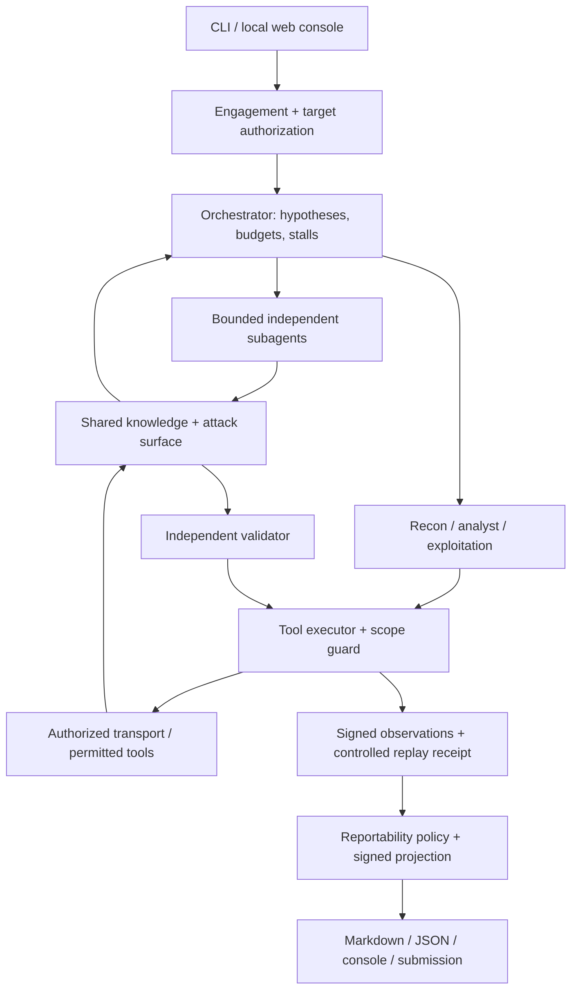

# Reynard

**Multi-agent security research with explicit scope, bounded execution, and evidence-backed reports.**

Reynard is a Python engine for authorized pentests, bug-bounty research, and
isolated CTF/lab work. Specialist agents investigate candidates; a separate
validator and deterministic export policy decide what can become a finding.

[Quickstart](#quickstart) · [Architecture](#architecture) · [Validation](#how-a-candidate-becomes-a-finding) · [Development](#development-and-testing) · [Security review](docs/security-review.md)

> **Current maturity:** the authorization and evidence boundaries are stronger
> than the breadth of trusted detection adapters. Many tool capabilities are
> available only in benchmark mode, and unsupported proof forms are suppressed.
> A passing test suite is not evidence of complete vulnerability coverage or
> superiority to another product.

## Quickstart

Python **3.10+** is required. Local tests and offline checks need neither an LLM
key nor a running Kali container.

```bash
python -m venv .venv
# macOS / Linux:
source .venv/bin/activate
# Windows PowerShell:
# .\.venv\Scripts\Activate.ps1

python -m pip install -e ".[dev,harness]"
python -m pytest -q
python scripts/audit_tools.py --check
python scripts/quality_metrics.py --check
```

For engine-only installation, use `python -m pip install -e .`. Optional extras
are `harness` (web console), `rag` (local embeddings), and `external` (Browser
Use). They do not expand an engagement's authorization.

### Configure a research run

Copy [`.env.example`](.env.example) to `.env` and configure a provider:

```env
LLM_DEFAULT_PROVIDER=deepseek
LLM_DEFAULT_MODEL=deepseek-chat
DEEPSEEK_API_KEY=your-provider-key
```

OpenAI, Anthropic, Qwen, and OpenAI-compatible gateways are also supported.
Per-role settings use names such as `LLM_RECON_MODEL`,
`LLM_VALIDATOR_PROVIDER`, and `LLM_PIVOT_MODEL`. Choose models available through
your provider; the example configuration is not a performance recommendation.

Create a scope file for a local service you control, for example `scope.yaml`:

```yaml
engagement:
  engagement_name: Local application review
  authorized_url_prefixes:
    - http://127.0.0.1:8080/
  out_of_scope: []
  max_requests_per_second: 2
  max_total_requests: 200
  allow_destructive: false
```

Validate it first. `--dry-run` checks the configuration and writes an empty
report; it does not test the target.

```bash
reynard-assess --engagement scope.yaml --target http://127.0.0.1:8080/ --dry-run --out reports/local
```

For authorized execution, start the configured runtime and omit `--dry-run`:

```bash
docker compose build
docker compose up -d
reynard-assess --engagement scope.yaml --target http://127.0.0.1:8080/ --out reports/local
```

Docker Desktop host-network behavior varies by configuration. Confirm how the
container reaches your local service. The supplied Compose configuration grants
broad capabilities; use a dedicated environment and read [Security and scope](#security-and-scope).

## Architecture



| Component | Responsibility |
| --- | --- |
| [Orchestrator](src/hacking_agent/cli/orchestrator.py) | Routes specialists, maintains the hypothesis agenda, bounds work, handles stalls and escalation. |
| [Agents](src/hacking_agent/agents/) | Recon, analysis, exploitation, validation, coordination, and report assembly. |
| [Typed schemas](src/hacking_agent/core/schemas.py) | Validate cross-agent tasks, results, and tool decisions. |
| [Tool boundary](src/hacking_agent/agents/base.py) | Scope checks, budget accounting, deduplication, captured observations, and state ingestion. |
| [Scope and transport](src/hacking_agent/core/scope.py) | Target authorization, request limits, testing windows, production capability restrictions, and redirect checks. |
| [State](src/hacking_agent/core/attack_surface.py) | Attack-surface records with provenance; knowledge graph, PoC ledger, and SQLite durable memory support investigations. |
| [Validation authority](src/hacking_agent/core/validation_provenance.py) | Authenticates executor captures, protocol receipts, artifact manifests, findings, and reports. |

Independent bootstrap work and reasoning can run in parallel. Identity-bearing
tool execution, shared tool state, and exploitation/validation lanes are
serialized by policy; subagent results retain a stable order. More agents
increase cost and coordination overhead.
`--max-subagents` bounds bootstrap concurrency; `--no-subagents` disables it.
See [subagent architecture](docs/subagents-architecture.md).

## Modes and commands

| Command | Use |
| --- | --- |
| `reynard-assess` | Engagement-based assessment and consolidated report; always production mode. |
| `reynard-orchestrator` | Direct multi-agent run; use explicit `--production` or `--benchmark`. |
| `reynard-harness` | Local web console and run lifecycle. |
| `reynard-lab-eval --pretty` | Offline lab-routing/readiness evaluation. This is not a solve-rate measurement. |
| `reynard` | Legacy single-agent CLI retained for compatibility; prefer the orchestrator for new workflows. |

Production is the default for ordinary targets. Recognized lab hosts or an
explicit lab profile can select benchmark mode; an attached engagement takes
precedence and forces production.

```bash
# Validate an existing engagement or local bounty-scope export.
reynard-assess --engagement eval/engagement.sample.yaml --dry-run
reynard-assess --bounty-scope eval/bounty_scope.sample.json --dry-run

# Explicitly authorized local target; add scope only when your authorization allows it.
reynard-orchestrator --production --no-oob --max-iterations 10 http://127.0.0.1:8080/

# Inspect arguments without starting research.
reynard-assess --help
reynard-orchestrator --help
reynard-lab-eval --help
```

Direct production runs receive a restrictive engagement inferred from the
declared target and scope flags, with default limits of 2 scoped requests/second
and 500 scoped requests. Use `reynard-assess` for explicit path restrictions,
denylists, timing windows, and client rules.

For controlled identities, the orchestrator accepts `--auth-file`:

```json
{
  "sessions": {
    "user-a": {"headers": {"Cookie": "session=YOUR_TEST_USER_A_COOKIE"}},
    "user-b": {"headers": {"Cookie": "session=YOUR_TEST_USER_B_COOKIE"}}
  }
}
```

Treat that file as a credential. Keep it outside version control.

## How a candidate becomes a finding

The customer export policy uses **reportability schema v2**:

1. The executor records request/response observations with run, identity,
   context, and capture bindings.
2. A supported deterministic adapter derives an effect. Model-authored proof
   metadata, request echoes, notes, and confidence cannot manufacture evidence.
3. Two distinct positive captures and a separate matched negative control form
   an authenticated validation receipt.
4. Required artifacts must exist in the authority's artifact store and match
   their signed manifests.
5. The evidence, full customer-facing finding projection, and report are
   authenticated. JSON, Markdown, API, aggregate counts, and submission exports
   recheck the same policy.

Missing, inconsistent, legacy, or unsupported evidence fails closed. Candidate
observations remain useful for investigation but are excluded from confirmed
customer findings.

**Adapter coverage is currently narrow.** The trusted executor derives browser
dialog execution and a specific template-evaluation signal. The broader proof
vocabulary does not imply implemented detectors for every class. Browser tools
are restricted in production pending a scoped transport; SQL, authorization,
timing, and independently correlated OOB adapters need further work. Synthetic
signed fixtures verify the policy without establishing those detectors.

On first signing use, a local key is created under
`~/.local/state/reynard/validation/`. Back up the authority key and artifact
store together when reports must remain verifiable. Key loss or rotation makes
old receipts fail closed. `REYNARD_HOST_EXEC` disables receipt creation and
verification because host-executed model tools could access the signing key.

The signatures establish local provenance, not the correctness of every
detector or protection from a compromised host account. Read the
[validation trust model](docs/validation-trust.md).

## Web console

```bash
reynard-harness
```

Open [http://127.0.0.1:8787/](http://127.0.0.1:8787/) and enter the operator token.
Set `REYNARD_HARNESS_TOKEN` before startup, or use the generated token printed
by the server. Login establishes an HttpOnly, same-site browser session;
API clients use `x-harness-token`. Tokens are not included in public bootstrap
HTML or accepted through event-stream query strings.

Create a run with targets, explicit scope, budgets, and the authorization
acknowledgment. The console shows events and worker output, reports, and
finding submissions. Runs execute in separate processes; the default job
concurrency is one. Run artifacts live under `logs/runs/<run-id>/`.

The console checks loopback Host and same-origin requests. Do not publish it
through a reverse proxy or expose its port. Model output and worker logs may
contain sensitive information even when finding exports are sanitized.
See [harness documentation](docs/harness.md).

## Configuration reference

| Area | Settings |
| --- | --- |
| Provider routing | `LLM_DEFAULT_*`, `LLM_RECON_*`, `LLM_ANALYST_*`, `LLM_EXPLOITATION_*`, `LLM_VALIDATOR_*`, `LLM_PIVOT_*` |
| Model budgets | `LLM_MAX_TOKENS_BUDGET`, `LLM_MAX_COST_BUDGET`; zero disables each cap. Cost limits require configured token prices. |
| Cost estimates | `LLM_INPUT_PRICE_PER_1K`, `LLM_OUTPUT_PRICE_PER_1K`; zero prices do not measure actual spend. |
| Dispatch limits | `MAX_ITERATIONS`, `MAX_SUBAGENTS`, `REYNARD_INNER_BUDGET` |
| Timeouts | `ASSESS_PER_TARGET_TIMEOUT`, `EVAL_PER_LAB_TIMEOUT`, `BROWSER_EXEC_TIMEOUT` |
| Runtime | `CONTAINER_NAME`; keep `REYNARD_HOST_EXEC` disabled for authenticated reports. |
| Persistence | `REYNARD_MEMORY_DB`, `REYNARD_EMBEDDINGS`, `REYNARD_EVENT_LOG` |
| Validation authority | `REYNARD_VALIDATION_STATE_DIR`, optional `REYNARD_VALIDATION_HMAC_KEY` |
| Console | `REYNARD_HARNESS_TOKEN`, `REYNARD_HARNESS_HOST`, `REYNARD_HARNESS_PORT` |
| Caido bridge | `CAIDO_LOCAL_BRIDGE_URL`, mandatory `CAIDO_LOCAL_BRIDGE_TOKEN` |

Per-request output limits and dispatch budgets reduce runaway work; they are
not guarantees against every provider's billing or an already submitted
external job. Use nonzero limits appropriate to the engagement.

Provider budget admission is checked before each call and retry. In-flight
calls or missing provider usage can still exceed the estimate. Engagement
`max_total_requests` currently applies **per target**, not across the entire
multi-target assessment; account for that when selecting target counts.

## Tools and integrations

Reynard keeps **75 dynamically dispatched tool implementations**, with exact
alignment between the runtime registry, JSON schemas, and typed names.
The audit found no registered tool proven dead. Absence from a static call
search is insufficient because models select tools by name.

Production availability is deliberately smaller: unrestricted shell commands,
browser navigation, several scanners, stateful parallel probes, and external
execution brokers are blocked until their downstream destinations can be
enforced. A tool appearing in the inventory is not permission to execute it.

| Integration | Current role |
| --- | --- |
| HTTPX transport | Bounded production HTTP; checks every redirect, charges additional hops, separates identity cookies, and drops sensitive headers across origins. |
| Playwright / browser tools | Existing lab/browser capabilities; production execution restricted pending destination enforcement. |
| Nuclei / ProjectDiscovery wrappers | Existing candidate discovery and recon capabilities; several are production-restricted. Scanner labels cannot become findings directly. |
| [Caido local bridge](docs/caido-local-bridge.md) | Authenticated loopback Replay/history API. Set the same random token of at least 32 characters in Reynard and the selected Caido environment. Browser origins and CORS access are rejected. |
| Burp, OSINT, Browser Use, HexStrike | Optional integrations; availability, credentials, and scope policy determine usable operations. External output is untrusted data. |
| Bandit | Development-time Python security review; not a target scanner or a new agent capability. |

Run `python scripts/audit_tools.py --check` for the inventory. Supply
`--events PATH_TO_EVENTS_JSONL` to measure observed usage from existing runs.
Static test references are not executed coverage.
[Measurement details](docs/offline-quality.md).

## Security and scope

- Explicit engagement scope replaces inferred scope; deny rules win. Lab and
  localhost exceptions do not widen an attached engagement.
- Domain authorization includes subdomains. URL-prefix authorization retains
  scheme, port, and path boundaries; use it when a whole host is not authorized.
- Explicit assessment targets are checked before work starts. Testing windows
  and request budgets are rechecked during execution.
- Production HTTP disables ambient proxy settings and automatic redirects.
  Response bodies are bounded to 64 KiB; redirects are bounded to 10.
- An assessment target timeout terminates and reaps its owned host process
  tree and discards incomplete findings. A later target may run after confirmed
  cleanup; unconfirmed cleanup stops scheduling. Container or remote jobs already
  submitted may need separate cleanup.
- Scope checks are application controls, not a network sandbox. DNS rebinding,
  same-account compromise, unknown tool side effects, and privileged container
configuration require additional environmental defenses.
- Keep provider keys, signing keys, sessions, and raw logs private. Review the
  rules of engagement before every run.
- Methodology caches use bounded, validated JSON and atomic replacement.
  Legacy pickle caches are ignored and left on disk; they are never loaded.

Use the supplied Docker configuration only in an isolated environment: it
requests host networking, additional Linux capabilities, and an unconfined
seccomp profile. These settings remain a hardening task.

## Development and testing

```bash
python -m pip install -e ".[dev,harness]"
python -m pytest --collect-only -q
python -m pytest -q
python -m ruff check .
python scripts/audit_tools.py --check
python scripts/quality_metrics.py --check
reynard-lab-eval --pretty
```

Additional diagnostic checks:

```bash
python -m mypy src
python -m bandit -r src -q
```

Repository-wide mypy still reports legacy typing errors. The Ruff configuration
checks a focused correctness baseline, not all style rules. Bandit findings
need review because this repository intentionally contains subprocess/tooling
code. Neither command should be presented as clean without checking its output.

The recorded full run passed 817 tests and 56 subtests, with 61.04% statement
coverage and one upstream Starlette/AnyIO deprecation warning. Coverage is not
branch coverage or proof of safe tool behavior. Exact commands, a narrowly
filtered strict-warning check, and the remaining type/security diagnostics are
recorded in the [validation record](docs/security-review.md#validation-record).

For the optional Caido plugin:

```bash
pnpm --dir integrations/caido-reynard-bridge install
pnpm --dir integrations/caido-reynard-bridge test
pnpm --dir integrations/caido-reynard-bridge typecheck
pnpm --dir integrations/caido-reynard-bridge build
```

The offline evidence benchmark uses synthetic signed SQL/browser records and
tampered or unauthenticated negatives. Its precision and false-positive rate
describe that small stored-evidence corpus only. No live solve rate, operational
false-positive rate, or comparison against XBOW has been established by this
review. See the [audit and research report](docs/security-review.md).

The separate `reynard-lab-eval --live` / `--train` path still uses a legacy
daemon-thread timeout and can count candidate PoC success as solved. It needs
process isolation and independent outcome grading before its scores can support
reliable time-bounded performance claims. The checks above use offline readiness
only.

## Troubleshooting

| Symptom | Check |
| --- | --- |
| CLI command is missing | Activate the environment and reinstall editable. The console also supports `python -m hacking_agent.harness.server`. |
| A tool is blocked in production | Read the scope rejection; production restrictions are intentional. Do not switch modes to bypass client rules. |
| No confirmed findings | Inspect suppression reasons, adapter coverage, scope, and budgets. Candidate count is not confirmed finding count. |
| Old report shows zero confirmed findings | Check schema version, authority key, artifact store, and run/projection signatures. Edited or legacy reports fail closed. |
| Harness returns 401/403 | Use its operator token/session, loopback address, and same-origin UI. Query-string tokens are not accepted. |
| Caido returns 503/401 | Configure the same token of at least 32 characters in both applications; Caido uses its selected environment. |
| Cost reads zero | Configure provider token prices; zero-priced metering is not free usage. |
| Container tools are missing | Check the selected Docker build profiles. The registry includes optional capabilities not installed in every image. |

## Further reading

[Validation trust](docs/validation-trust.md) ·
[Offline quality](docs/offline-quality.md) ·
[Security audit](docs/security-review.md) ·
[Production architecture](docs/production-research-architecture.md) ·
[Harness](docs/harness.md) ·
[Caido](docs/caido-local-bridge.md) ·
[External integrations](docs/external-integrations.md) ·
[Lab coverage](docs/portswigger-coverage-matrix.md)
