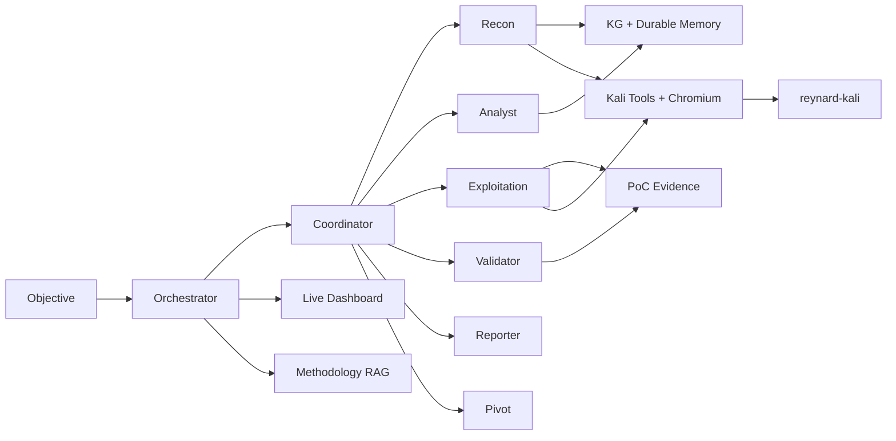

<div align="center">

```
██████╗ ███████╗██╗   ██╗███╗   ██╗ █████╗ ██████╗ ██████╗
██╔══██╗██╔════╝╚██╗ ██╔╝████╗  ██║██╔══██╗██╔══██╗██╔══██╗
██████╔╝█████╗   ╚████╔╝ ██╔██╗ ██║███████║██████╔╝██║  ██║
██╔══██╗██╔══╝    ╚██╔╝  ██║╚██╗██║██╔══██║██╔══██╗██║  ██║
██║  ██║███████╗   ██║   ██║ ╚████║██║  ██║██║  ██║██████╔╝
╚═╝  ╚═╝╚══════╝   ╚═╝   ╚═╝  ╚═══╝╚═╝  ╚═╝╚═╝  ╚═╝╚═════╝
```

# Reynard

**Autonomous multi-agent engine for CTFs, labs, and authorized security testing**

LLM reasoning · Kali Docker runtime · real Chromium · hypothesis-driven orchestration

<br/>

[](./pyproject.toml)
[](./pyproject.toml)
[](./Dockerfile)
[](./docs/portswigger-coverage-matrix.md)
[](#-scope--safety)

<br/>

```bash
python orchestrator.py --ui --preflight "https://YOUR-AUTHORIZED-TARGET"
```

</div>

---

## Why Reynard

Reynard is not a script runner with an LLM bolted on. It is a **structured multi-agent penetration engine** that plans, probes, pivots, validates, and reports — with durable memory, methodology RAG, and a real browser in the loop.

| Layer | What you get |
| --- | --- |
| **Agents** | Coordinator · Recon · Analyst · Exploitation · Validator · Reporter · Pivot |
| **Runtime** | Kali container with scanners, pwn/mobile/forensics tools, headless Chromium |
| **Brain** | Hypothesis agenda, phase chaining, backtracking, self-critique, tiered model escalation |
| **Memory** | Knowledge graph + SQLite cross-run store + 38 methodology playbooks via RAG |
| **Proof** | PoC evidence store, validator replay, report gating against premature “done” |

> **Authorized use only.** Run Reynard against systems you own, intentionally vulnerable labs, CTF infrastructure, or targets covered by explicit written authorization.

---

## Highlights

<table>
<tr>
<td width="50%">

### Multi-agent core
Coordinator routes specialists through a lock-protected state machine. Bounded bootstrap subagents parallelize profile / readiness / research; exploitation stays serialized by default.

</td>
<td width="50%">

### Hypothesis agenda
Six-phase StrategyEngine (`RECON → INJECTION → CONTEXT → CAPABILITY → ESCAPE → EXPLOIT`). Failed vectors demote. Stuck runs escalate to a high-reasoning `pivot` role before concluding failure.

</td>
</tr>
<tr>
<td width="50%">

### Real browser proof
Headless Chromium via Playwright inside the container — genuine DOM/JS execution and XSS `alert()` capture (`browser_navigate` / `browser_execute_js` / `browser_interact`).

</td>
<td width="50%">

### Expert lab layer
Deterministic playbooks for PortSwigger practitioner/expert classes across **213 labs · 31 classes**, plus offline readiness scoring and live solve-rate scorecards.

</td>
</tr>
<tr>
<td width="50%">

### Cross-domain targets
Web · network · binary/pwn · mobile · crypto · stego · forensics · CTF-misc — each seeds a category-appropriate tool agenda.

</td>
<td width="50%">

### Client assessments
`reynard-assess` runs scoped recon → enumerate → per-target test → consolidated report, gated by engagement rules of engagement.

</td>
</tr>
</table>

**Also built in**

- Automatic tool selection per vuln-class / phase / stack (`recommend_tools`)
- Structured parsers for `ffuf`, `sqlmap`, `nmap`, `nuclei`
- Local RAG over `methodologies/` (sentence-transformers → Ollama → BM25)
- Token/cost metering with hard budget caps
- Caido Local Bridge + Cloud API, Burp MCP fallback
- Optional OSINT via Shodan / Censys
- Live dashboard at `http://127.0.0.1:8765`
- Tiered model escalation (`LLM_STRONG_*`) for expert labs and stalls
- Batch training loop: `reynard-lab-eval --train`

---

## Architecture



**Startup bootstrap** (safe parallel lanes): profile analyst → Caido readiness → session readiness → OOB readiness → then coordinator routing.

---

## Quick Start

### 1. Configure

```bash
cp .env.example .env
```

Set at least one provider. DeepSeek example:

```env
LLM_DEFAULT_PROVIDER=deepseek
LLM_DEFAULT_MODEL=deepseek-chat
DEEPSEEK_API_KEY=sk-your-key
```

OpenAI-compatible gateway:

```env
LLM_DEFAULT_PROVIDER=openai-compatible
LLM_DEFAULT_MODEL=your-model
LLM_DEFAULT_BASE_URL=https://your-gateway/v1
LLM_DEFAULT_API_KEY=sk-your-key
```

### 2. Install

```bash
python -m venv venv
# Windows: .\venv\Scripts\Activate.ps1
source venv/bin/activate
pip install -r requirements.txt
pip install -e .
# Optional higher-quality RAG embeddings:
pip install "reynard[rag]"
```

### 3. Start the Kali runtime

```bash
docker compose build
docker compose up -d
docker ps --filter "name=reynard-kali"
```

First build is large: Kali packages, Go tools, Z4nzu HackingTool, Playwright Chromium, plus cross-domain tooling (`gdb`/`pwntools`, `radare2`, `apktool`/`jadx`/`frida`, `tshark`, `steghide`, `hashcat`/`john`, …).

### 4. Preflight, then run

```bash
python orchestrator.py --preflight "https://TARGET"
python orchestrator.py --ui --no-oob --max-iterations 25 \
  "Solve this authorized CTF/lab target: https://TARGET"
```

Dashboard → `http://127.0.0.1:8765`

<details>
<summary><b>PowerShell equivalents</b></summary>

```powershell
Copy-Item .env.example .env
python -m venv venv
.\venv\Scripts\Activate.ps1
pip install -r requirements.txt
pip install -e .
docker compose build
docker compose up -d
python orchestrator.py --ui --no-oob --max-iterations 25 "Authorized lab: https://TARGET"
```

</details>

---

## Usage Modes

### CTF / lab solve

```bash
python orchestrator.py --ui --max-iterations 40 \
  "Authorized CTF target: http://10.10.10.10/. Scope: this host only. Capture the flag."
```

PortSwigger example:

```bash
python orchestrator.py --ui --no-oob --max-iterations 25 \
  "Solve this authorized PortSwigger lab: SQL injection vulnerability in WHERE clause allowing retrieval of hidden data. Target: https://YOUR-LAB.web-security-academy.net/"
```

Tips: keep scope explicit · use `--ui` · prefer `--no-oob` only when blind callbacks are unnecessary · raise `--max-iterations` for full boxes.

### Offline readiness + live scorecard

```bash
# Offline readiness (no attack)
reynard-lab-eval --pretty
reynard-lab-eval --case "JWT authentication bypass lab. Target: https://YOUR-LAB.web-security-academy.net/" --pretty

# Live solve-rate scorecard
reynard-lab-eval --live --config eval/labs.sample.yaml \
  --per-lab-timeout 900 --max-iterations 30

# Batch training loop (re-run unsolved labs at the strong tier + refresh coverage matrix)
reynard-lab-eval --train --config eval/labs.sample.yaml
```

Coverage matrix: [`docs/portswigger-coverage-matrix.md`](./docs/portswigger-coverage-matrix.md)  
Default suite maps every PortSwigger topic in that matrix (213 labs across 31 classes).

### Authorized client assessment

```bash
reynard-assess --engagement eval/engagement.sample.yaml --dry-run
reynard-assess --engagement eval/engagement.sample.yaml --out reports/acme
reynard-assess --engagement eval/engagement.sample.yaml \
  --target https://app.example.com/ --max-iterations 40
```

Engagement configs declare authorized domains/CIDRs, out-of-scope denylist, rate limits, destructive-action policy, and testing window. **Reynard refuses to run without an authorized scope.**

### Authenticated / IDOR testing

```bash
python orchestrator.py --ui --auth-file auth-sessions.json --max-iterations 60 \
  "Authorized pentest for https://app.example.com. Scope: app.example.com only."
```

```json
{
  "sessions": {
    "user1": { "headers": { "Cookie": "session=USER1_COOKIE" } },
    "user2": { "headers": { "Cookie": "session=USER2_COOKIE" } }
  }
}
```

### Single-agent compatibility

```bash
python agent.py --ui "Authorized target: https://TARGET"
# or: reynard / reynard-orchestrator / reynard-lab-eval / reynard-assess
```

---

## Scope & Safety

**In scope by design**

- PortSwigger Web Security Academy labs
- Hack The Box / TryHackMe / CTF boxes you are allowed to attack
- Local vulnerable apps (DVWA, Juice Shop, WebGoat, intentional Docker labs)
- Authorized pentest environments with a defined engagement

**Out of scope / refuse**

- Targets without permission
- DDoS, phishing, RATs, credential stuffing, social engineering outside a sanctioned lab
- Wireless deauth or disruptive testing unless explicitly authorized
- Production testing without rate limits, test windows, and written approval

---

## Tool Runtime

Container name: **`reynard-kali`**. Tools execute via `run_shell`; call `tool_inventory` at runtime.

| Goal | Preferred tools |
| --- | --- |
| HTTP proof | `http_request`, `curl` |
| SQLi | `curl` (simple) · `sqlmap` (blind/complex) |
| Content discovery | `ffuf`, `gobuster`, `dirb`, `wfuzz` |
| CVE / misconfig | `nuclei`, `nikto`, `whatweb` |
| Ports / services | `nmap`, `masscan` / `rustscan` |
| JS / API endpoints | `extract_js_endpoints`, `katana`, `gospider` |
| XSS | `browser_execute_js`, `dalfox`, `XSStrike` |
| Secrets | `trufflehog`, `gitleaks`, `SecretFinder` |
| Hashes | `john`, `hashcat`, `haiti` |
| AD labs | `impacket`, `nxc`, `BloodHound`, `Certipy` |
| Cloud / containers | `prowler`, `pacu`, `ScoutSuite`, `trivy` |
| Reversing / mobile | `radare2`, `ghidra`, `jadx`, `apktool`, `frida`, `objection` |
| Forensics / stego | `binwalk`, `foremost`, `steghide`, `volatility3` |
| Cross-domain helpers | `metasploit_run`, `gdb_debug`, `pwn_template`, `stego_extract`, `crypto_helper`, `forensics_triage`, `flag_hunter` |

The image also mounts [Z4nzu/hackingtool](https://github.com/Z4nzu/hackingtool) at `/opt/hackingtool/hackingtool.py`. Prefer direct non-interactive binaries for autonomous runs; interactive menus are a fallback reference.

```bash
docker exec -it reynard-kali bash
python3 /opt/hackingtool/hackingtool.py
```

---

## Integrations

### Caido

| Path | Purpose |
| --- | --- |
| **Local Bridge** | Replay, HTTP history, collections, findings — preferred for API testing |
| **Cloud API** | User / team / workspace / subscription / PAT operations |

```env
CAIDO_LOCAL_BRIDGE_URL=http://127.0.0.1:17650
CAIDO_LOCAL_BRIDGE_TOKEN=optional-shared-secret
CAIDO_PAT=caido_YOUR_PERSONAL_ACCESS_TOKEN
CAIDO_API_BASE_URL=https://api.caido.io
```

Bridge plugin: [`integrations/caido-reynard-bridge/`](./integrations/caido-reynard-bridge/) · contract: [`docs/caido-local-bridge.md`](./docs/caido-local-bridge.md)

### Burp MCP (fallback)

When the Burp MCP extension is online (`BURP_MCP_URL=http://127.0.0.1:9876`): raw HTTP/1.1, scanner issues, Collaborator, Repeater, Intruder. Offline → Caido Local Bridge / `http_request` / `curl` / OOB.

### Web research & OSINT

```env
BRAVE_SEARCH_API_KEY=...
SERPAPI_API_KEY=...
SHODAN_API_KEY=...          # prod assessments
CENSYS_API_ID=...
CENSYS_API_SECRET=...
```

No search keys → DuckDuckGo HTML fallback. For blind XXE/SSRF/CMDi, do **not** pass `--no-oob`.

---

## Configuration

Authoritative commented list: [`.env.example`](./.env.example)

| Area | Key knobs |
| --- | --- |
| Sampling / reasoning | `LLM_DEFAULT_TEMPERATURE`, `LLM_DEFAULT_MAX_TOKENS`, `LLM_*_REASONING_EFFORT`, `LLM_*_THINKING` |
| Budgets | `LLM_MAX_TOKENS_BUDGET`, `LLM_MAX_COST_BUDGET`, `LLM_*_PRICE_PER_1K` |
| Strong tier | `LLM_STRONG_*`, `REYNARD_TIER_ESCALATION`, `REYNARD_ESCALATE_ON_EXPERT` |
| RAG | `REYNARD_EMBEDDINGS`, `REYNARD_EMBEDDINGS_MODEL`, `OLLAMA_BASE_URL` |
| Memory | `REYNARD_DURABLE_MEMORY`, `REYNARD_MEMORY_DB` |
| Context | `REYNARD_CONTEXT_COMPACTION`, `REYNARD_CONTEXT_MAX_CHARS`, `REYNARD_PROMPT_CACHE` |
| Strategy | `REYNARD_REPORT_GATING`, `REYNARD_MAX_REPORT_GATES`, `REYNARD_INNER_BUDGET` |
| Browser | `BROWSER_EXEC_TIMEOUT` |
| Eval / assess | `EVAL_PER_LAB_TIMEOUT`, `ASSESS_PER_TARGET_TIMEOUT` |
| Flags | `REYNARD_FLAG_REGEX` |

### LLM providers

| Provider | Env | Notes |
| --- | --- | --- |
| `deepseek` | `DEEPSEEK_API_KEY` | OpenAI-compatible |
| `openai` / `gpt` | `OPENAI_API_KEY` | OpenAI models |
| `anthropic` / `claude` | `ANTHROPIC_API_KEY` | Messages API + cache breakpoints |
| `qwen` / `dashscope` | `QWEN_API_KEY` / `DASHSCOPE_API_KEY` | DashScope |
| `local` | optional | `http://localhost:8000/v1` |
| `ollama` | optional | `http://localhost:11434/v1` |
| `openai-compatible` | `LLM_DEFAULT_API_KEY` | Custom gateway |

Per-role overrides: `coordinator` · `recon` · `analyst` · `exploitation` · `validator` · `reporter` · `pivot` · `strong` — each supports `_PROVIDER`, `_MODEL`, `_API_KEY`, `_BASE_URL`, `_REASONING_EFFORT`, `_THINKING`, `_TEMPERATURE`, `_MAX_TOKENS`. Unsupported provider parameters auto-downgrade at runtime.

---

## Project Structure

```text
reynard/
├── agent.py                 # Single-agent launcher
├── orchestrator.py          # Multi-agent launcher
├── Dockerfile               # Kali + Chromium + cross-domain toolchain
├── docker-compose.yml       # reynard-kali service
├── pyproject.toml           # Package metadata · v2.1.0
├── .env.example             # Full env template
├── methodologies/           # 38 bug-class playbooks (RAG corpus)
├── eval/                    # Lab corpus, sample configs, engagement template
├── docs/                    # Coverage matrix, subagents, Caido bridge, expert notes
├── integrations/
│   └── caido-reynard-bridge/  # Local Caido plugin
├── scripts/                 # Runtime checks
└── src/hacking_agent/
    ├── agents/              # coordinator, recon, analyst, exploitation, validator, reporter
    ├── cli/                 # reynard, reynard-orchestrator, reynard-lab-eval, reynard-assess
    ├── core/                # strategy, memory, RAG, tools, metering, playbooks, …
    ├── integrations/        # Burp, Caido, Shodan, race helpers
    └── ui/                  # Live dashboard
```

---

## Common Commands

```bash
docker compose up -d
docker ps --filter "name=reynard-kali"
docker exec -it reynard-kali bash

python orchestrator.py --ui --max-iterations 40 "Authorized target: https://TARGET"
python orchestrator.py --preflight "https://TARGET"
python orchestrator.py --max-subagents 4 "Authorized lab: https://TARGET"
python orchestrator.py --no-subagents "Authorized lab: https://TARGET"

reynard-lab-eval --pretty
reynard-lab-eval --live --config eval/labs.sample.yaml
reynard-assess --engagement eval/engagement.sample.yaml

docker compose down
```

Logs, scorecards, and reports land under `logs/` (gitignored).

---

## Recommended Workflow

1. `docker compose up -d`
2. Configure `.env` + optional `--auth-file` / engagement YAML
3. `--preflight` until readiness looks green
4. Run with `--ui` and an explicit authorized scope
5. Let the validator replay successful PoCs
6. Review the final report (or assessment aggregate under `--out`)
7. Fold hard-won lessons into `methodologies/` when the agent struggles

---

## Docs

| Doc | Topic |
| --- | --- |
| [`docs/portswigger-coverage-matrix.md`](./docs/portswigger-coverage-matrix.md) | Expert coverage · labs · fast-paths |
| [`docs/subagents-architecture.md`](./docs/subagents-architecture.md) | Bounded parallel lanes |
| [`docs/expert-lab-upgrade.md`](./docs/expert-lab-upgrade.md) | Playbook + failure classifier |
| [`docs/caido-local-bridge.md`](./docs/caido-local-bridge.md) | Local bridge contract |
| [`integrations/caido-reynard-bridge/README.md`](./integrations/caido-reynard-bridge/README.md) | Bridge plugin build/install |

---

## Legal Notice

Reynard is for education, CTFs, research labs, and **authorized** security assessments only. You are responsible for ensuring every target, technique, and tool invocation is permitted by the applicable rules of engagement and law.

<div align="center">

<br/>

**Reynard** · think like a fox · prove like an engineer

`v2.1.0`

</div>
